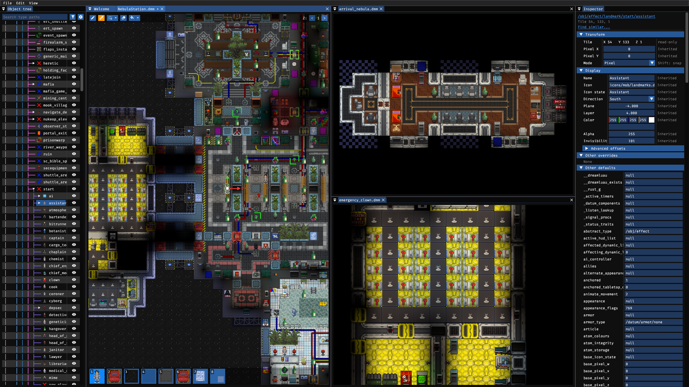

# Rapid Mapping Device

Rapid Mapping Device (rmd) is a map editor for Space Station 13 that can run DM code from your codebase. A profile can call existing procedures to preview smoothing, overlays, lighting, and connections. Your codebase remains the source of truth for these previews.



## Features

- **Map editing:** Select and resize regions. Fill, copy, move, rotate, or mirror tiles. Edit individual atoms from the map context menu.
- **Appearance previews:** Run a DM profile to draw icon states, overlays, and underlays. RMD updates affected tiles after edits, undo, and redo.
- **Lighting:** Preview lights and blockers across Z levels. Use the viewport settings to hide lighting or reduce darkness.
- **Profile tools:** Show connection guides and map highlights. Profiles can add UI panels and enable the Node tool for routing connected objects.
- **Map navigation:** Browse the object tree, inspect placed atoms, and use tile and pixel grids when you need precise placement.
- **Git integration:** Resolve map merge conflicts tile by tile, see which commit last changed each tile, and diff the map against any revision.

## Start editing

Download the editor for Windows or Linux from [Releases](https://github.com/exdal/rmd/releases). Start it, open your `.dme` from the welcome page, and then open a `.dmm` map.

From a source checkout with the build dependencies installed, you can open both files directly:

```sh
cargo run --release --bin rmde -- path/to/codebase.dme path/to/map.dmm
```

The repository pins its Rust toolchain in [`rust-toolchain.toml`](rust-toolchain.toml). On Linux, [`shell.nix`](shell.nix) provides a development shell with the native build dependencies.

## Work with Git

When a map is inside a Git worktree, open **Git > Git Panel**. The editor runs your installed `git`, so it must be on your `PATH`.

- **Conflicts:** When a merge leaves conflicts in a `.dmm`, load them from the panel. The viewport marks conflicting tiles. Take ours or theirs for a tile, a region, or a selection from the panel or the map context menu. When every tile is resolved, **Mark resolved** stages the map with `git add`.
- **Blame:** Run blame to find the commit that last changed each tile. Show a heatmap from newest to oldest, hover a tile to see its commit, and click it to pin the details. Select a commit in the panel to outline its tiles. **Settings > Git > Blame history depth** limits how many revisions blame walks.
- **Diff:** Compare the working map with HEAD, with a commit from the map's history, or between any two revisions such as branches, tags, or hashes. The viewport shows the changed tiles, and you can restore tiles from the other version.

To turn off the integration, clear **Settings > Git > Enable Git map integration**.

## Integrate your codebase

The editor includes profiles for CMSS13, Goonstation, Monkestation, tgstation, and Vanderlin. To try one, open your `.dme` and choose it under **Settings > Compiler > Forced bundled profile**. The bundled profile runs without changes to your codebase.

To keep a profile in your codebase:

1. Add a DM file to your project and include it from the `.dme`.
2. Put the profile inside an `#ifdef __DEMIR_BAKE__` block. BYOND skips this block, and editor's compiler reads it when it builds a map preview.
3. Create a `/datum/demir` subtype. Set `default = TRUE` directly on exactly one profile.

For example, this profile sets the icon state for placed walls:

```dm
#ifdef __DEMIR_BAKE__

/datum/demir/my_codebase
	default = TRUE

	bake(atom/target)
		if(istype(target, /turf/closed/wall))
			target.icon_state = "wall"

#endif
```

Use a wall type and icon state from your codebase. Reload the `.dme` in the editor to see changes to the profile. Check **Settings > Compiler > Diagnostics** if a bake fails.

You can also check a profile from the command line:

```sh
cargo run --release --bin rmdc -- bake path/to/codebase.dme path/to/map.dmm --summary
```

The [profile guide](docs/demir.md) covers lighting, connections, highlights, UI hooks, and the Node tool. The [bundled profiles](examples/profiles) show how these hooks work in larger codebases.
